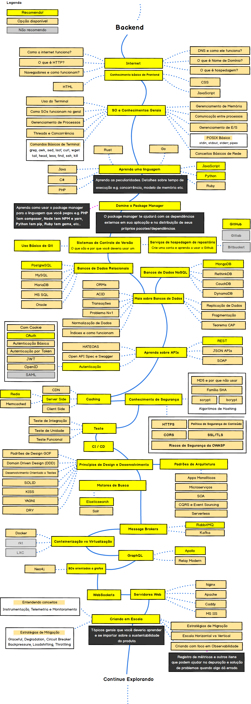

# 🕹️ A Jornada do Dev Back-End – Missões de Lógica

Fala, aventureiro(a) do código! 👋  
Bem-vindo à **Jornada em PHP**, uma aventura cheia de desafios de lógica para fortalecer suas habilidades.  
Aqui, cada exercício é uma **missão**, e você vai ganhar experiência e conhecimento a cada passo.  

> "Como se torna insubstituível? Depende da ideia, depende da gente. Aprender não é só acumular conhecimento, é aplicar e colocar a mão na massa!" ⚔️💡

---

## ⚔️ Missão Inicial: Preparação

Antes de sair na aventura, algumas dicas de sobrevivência:  
- Não precisa seguir a ordem dos desafios. Escolha sua missão inicial.  
- Comece identificando **entradas, saídas e processamento**.  
- Depois, crie um fluxograma no Flowgorithm para planejar seus ataques… digo, código.  
- Por último, codifique no Visual Studio Code e veja sua magia ganhar vida.  
- O foco é **PHP**, esqueça HTML ou CSS agora.  

💀 Confesso: o projeto que mais caprichei (meio gótico) foi o **erro-permissao-negada**, um verdadeiro boss fight de lógica.

---

## 🗡️ Missões da Jornada

Cada missão concede XP. Ao acumular pontos, você **desbloqueia novas missões ou dicas secretas**.  
Bons estudos e **não hesite em me chamar se quiser trocar ideia!** 👊

### 🌟 Missão 1 – Área do Triângulo
- Objetivo: Calcular a área do triângulo.  
- Recompensa: XP de 50 pontos  
- **Solução:** `calculo-area-triangulo`

### 🌟 Missão 2 – Desconto para sábios (65+)  
- Objetivo: Receber nome, idade e valor das compras.  
- Condição: Se idade ≥ 65 e compras ≥ R$1000, aplicar desconto de 10%.  
- Recompensa: XP de 70 pontos  
- **Solução:** `calculo-desconto-65anos`

### 🌟 Missão 3 – VIP Challenge  
- Objetivo: Receber nome, valor e tipo de cliente.  
- Condição: Se VIP, aplicar desconto de 10%.  
- Recompensa: XP de 60 pontos  
- **Solução:** `calculo-desconto-vip`

### 🌟 Missão 4 – Maioridade Check  
- Objetivo: Receber nome e ano de nascimento, informar idade e maioridade.  
- Recompensa: XP de 40 pontos  
- **Solução:** `calculo-idade-simples`

### 🌟 Missão 5 – Imposto do Reino  
- Objetivo: Receber nome e renda, calcular 7,5% de imposto.  
- Recompensa: XP de 50 pontos  
- **Solução:** `calculo-imposto-mes`

### 🌟 Missão 6 – Magia da Temperatura  
- Objetivo: Converter Celsius em Fahrenheit.  
- Recompensa: XP de 30 pontos  
- **Solução:** `celsius-to-fahrenheit`

### 🌟 Missão 7 – Guardião do Acesso  
- Objetivo: Receber nome e idade, informar faixa etária e acesso ao sistema.  
- Condição: Apenas maiores de 18 entram.  
- Faixas etárias:  
  - <11 → Criança  
  - 12–17 → Adolescente  
  - 18–25 → Jovem  
  - 26–60 → Adulto  
  - >60 → Melhor idade  
- Recompensa: XP de 100 pontos (boss fight!)  
- **Solução:** `erro-permissao-negada`

### 🌟 Missão 8 – Perímetro do Triângulo  
- Objetivo: Calcular a soma dos lados do triângulo.  
- Recompensa: XP de 40 pontos  
- **Solução:** `perimetro-do-triangulo`

---

## 📜 Itens de Suporte (Dicas)

**Operadores de comparação em PHP:**  
- `>` Maior  
- `>=` Maior ou igual  
- `<` Menor  
- `<=` Menor ou igual  
- `==` Igual  
- `!=` Diferente  

💡 **Dica do Mago:** Faça fluxogramas antes de codar para não se perder nas armadilhas do código.  

---

## 🚨 Guilda do Dev

- Abra **Pull Requests** para melhorias.  
- Participe das **Issues** com ideias e dúvidas.  
- Compartilhe o repositório com seus aliados.  

---

## 🎓 Mestre da Jornada

Agradecimentos ao professor **Arley Siaci Augusto**, por guiar os aprendizes durante a UC3 do curso de Back-end do Senac. 🙏  

📌 **Mapa do tesouro**: para te ajudar na progressão ao longo dos níveis e conclusão das tarefas.  

